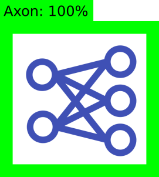

# Axon (ml-app)

Welcome to the WPILib project. This repository contains Axon.

- [WPILib Mission](#wpilib-mission)
- [Building (Development)](#building-development)
- [Building (Release)](#building-release)
- [Contributing to WPILib](#contributing-to-wpilib)

## WPILib Mission

The WPILib Mission is to enable FIRST teams to focus on writing game-specific software rather than on hardware details "raise the floor, don't lower the ceiling". We try to enable teams with limited programming knowledge and/or mentor experience to do as much as possible, while not hampering the abilities of teams with more advanced programming capabilities. We support Kit of Parts control system components directly in the library. We also strive to keep parity between major features of each language (Java, C++, and NI's LabVIEW), so that teams aren't at a disadvantage for choosing a specific programming language. WPILib is an open-source project, licensed under the BSD 3-clause license. You can find a copy of the license [here](https://github.com/wpilibsuite/allwpilib/blob/master/LICENSE.txt).

# Building (Development)

Building Axon is very straightforward. Axon uses yarn to compile.

## Requirements

- [Docker](https://www.docker.com/)
- [Node.js 14](https://nodejs.org/)
- [Yarn pkg](https://yarnpkg.com/)

To install additional required packages before launching, run the command `yarn`.

## GUI/Server Development

If you are developing TypeScript (not using Docker), you can start Axon by running `yarn dev` from the root directory. You will not be able to run any Docker containers from this command, but it will build the TypeScript very fast.

## Docker Development

If you are doing work with or relating to Docker containers, the `yarn dockerdev` command will work for you. It will take roughly 4 minutes to start Axon after running this command.

If you are working with the Docker containers, you can test your local version of your container by building your container manually after running `yarn dockerdev`. This is done by opening a second terminal, and running a command similar to `docker build -t wpilib/axon-NAME:edge .`

# Building (Release)

The CI will build a launcher when a tag is published on GitHub. It will also build Docker containers with the same tag.

# Contributing to WPILib

See [CONTRIBUTING.md](https://github.com/wpilibsuite/allwpilib/blob/master/CONTRIBUTING.md).
